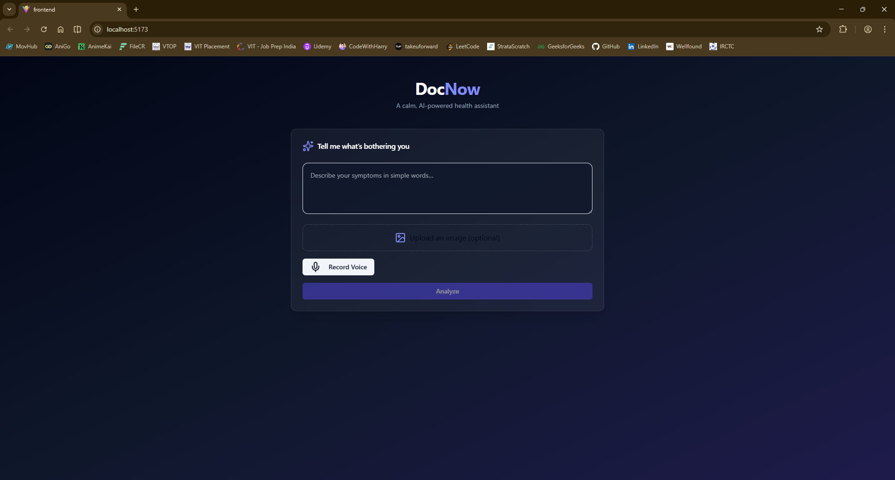
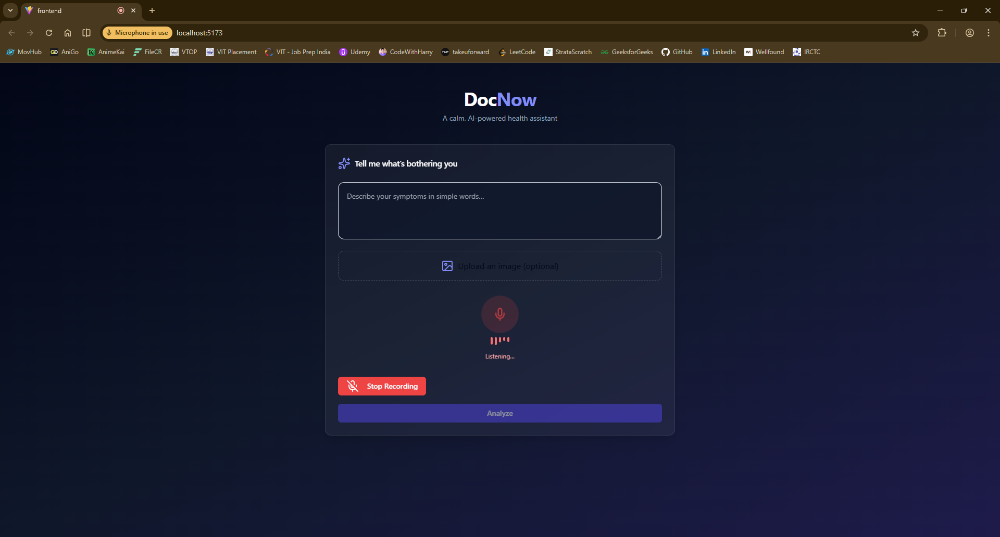
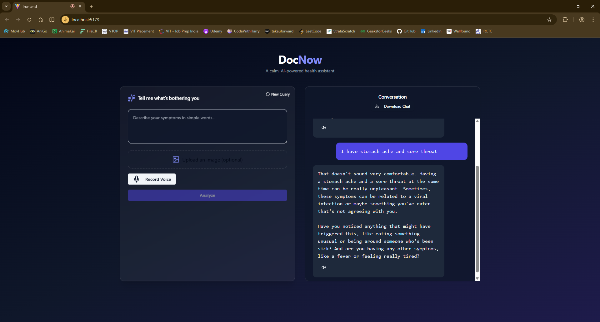
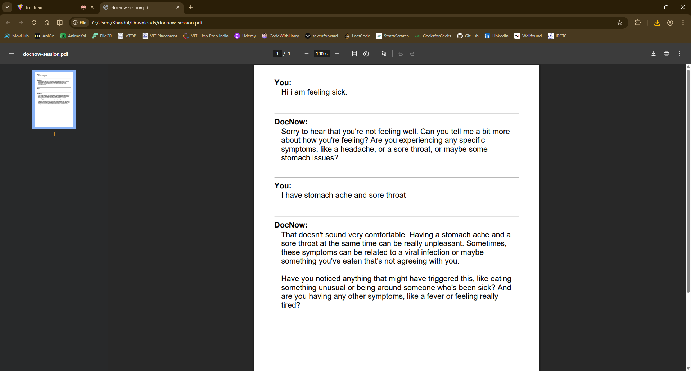

# DocNow v2

DocNow v2 is a full-stack, multimodal AI application that allows users to interact using **voice, text, and images** and receive **clear, spoken and written health-related explanations**. The system is designed strictly for **educational purposes** and intentionally avoids medical diagnosis, focusing instead on clarity, reassurance, and responsible AI behavior.

---

## ✨ Features

- Voice, text, and image-based input
- Conversational context with chat history
- Speech-to-text using Whisper (via Groq)
- Multimodal reasoning using Groq-hosted LLMs
- Text-to-speech with ElevenLabs (fallback to gTTS)
- Real-time audio playback and recording
- PDF export of conversation history
- API-first backend with clean separation of concerns

---

## 🏗️ Architecture Overview

DocNow v2 follows a **decoupled, API-driven architecture**:

### Backend
- Built with **FastAPI**
- Layered structure:
  - **Routers**: HTTP request handling
  - **Services**: Business logic and AI orchestration
  - **Utils**: Shared helpers and file handling
- REST endpoints for:
  - `/analyze` – multimodal analysis
  - `/transcribe` – speech-to-text
  - `/tts` – text-to-speech
- Robust input validation, temporary file management, and fallback handling

### Frontend
- Built with **React + Vite**
- Tailwind CSS + shadcn/ui components
- Centralized API client using Axios
- Supports:
  - Browser-based voice recording
  - Image uploads
  - Audio playback
  - Session export as PDF

---

## 📂 Project Structure (Simplified)

```bash
DocNow-v3/
├── backend/
│ ├── app/
│ │ ├── routers/
│ │ ├── services/
│ │ ├── utils/
│ │ └── main.py
│ └── requirements.txt
└── frontend/
├── src/
│ ├── api/
│ ├── components/
│ └── App.jsx
└── package.json
```


---

## ⚙️ Setup Instructions

### Backend

1. Navigate to backend directory:
   ```bash
   cd backend
   ```

2. Create and activate a virtual environment:
    ```bash
    python -m venv venv
    source venv/bin/activate  # Windows: venv\Scripts\activate
    ```

3. Install dependencies:
    ```bash
    pip install -r requirements.txt
    ```

4. Create a .env file:
    ```bash
    GROQ_API_KEY=your_groq_api_key
    ELEVENLABS_API_KEY=your_elevenlabs_api_key
    ```

5. Run the server:
    ```bash
    uvicorn app.main:app --reload
    ```


### Frontend

1. Navigate to frontend directory:
    ```bash
    cd frontend
    ```

2. Install dependencies:
    ```bash
    npm install
    ```

3. Create a .env file:
    ```bash
    VITE_API_BASE_URL=http://localhost:8000
    ```

4. Start the development server:
    ```bash
    npm run dev
    ```

## 📸 Web App Preview

### Home & Input Interface


### Voice Recording


### Conversation View


### Export Session as PDF



## ⚠️ Disclaimer

DocNow is intended only for educational use.
It does not provide medical diagnoses and should not replace consultation with qualified healthcare professionals.